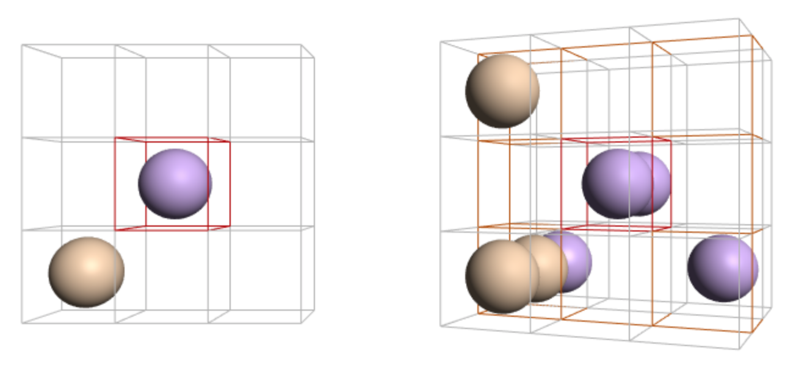
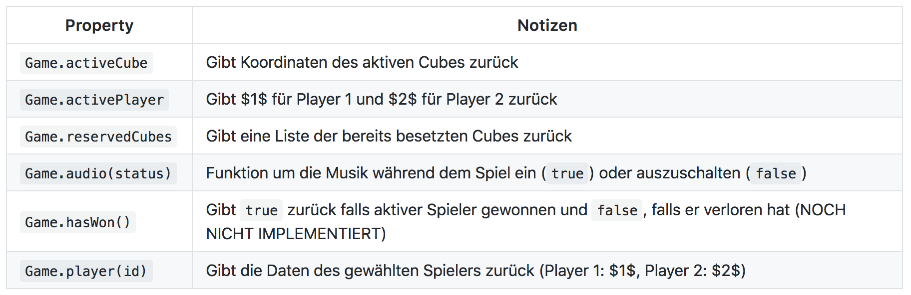

# Bericht: 3D TIC TAC TOE

> Werthmüller Melvin, Christensen Christopher, Arnold Lukas

In dieser Projektarbeit wurde eine modifizierte Version eines Tic-Tac-Toe (https://en.wikipedia.org/wiki/Tic-tac-toe) im dreidimensionalen Raum entwickelt. Das Spiel ist unter dem folgendem Link verfügbar: https://chefe.github.io/3d-tic-tac-toe/webgl/index.html

##### Technologie

Das Programm wurde mit WebGL realisiert und die Game Logik wurde mit Vanilla Javascript implementiert.

##### Visueller Aufbau

Das Tic-Tac-Toe setzt sich aus einem Grid aus 27 einzelnen Würfel zusammen. Die Ansicht auf der linken Seite stellt die aktiv ausgewählte Ebene in einem 3x3 Grid dar. Vom Spieler markierte Felder werden mit einer farbigen Kugel dargestellt. Diese werden, zur optischen Verschönerung, von einer Lichtquelle beleuchtet.  

##### Game Logik

Um den Spielstand an den WebGL-Teil des Programms zu übergeben wurde die folgende Schnittstelle erstellt:

